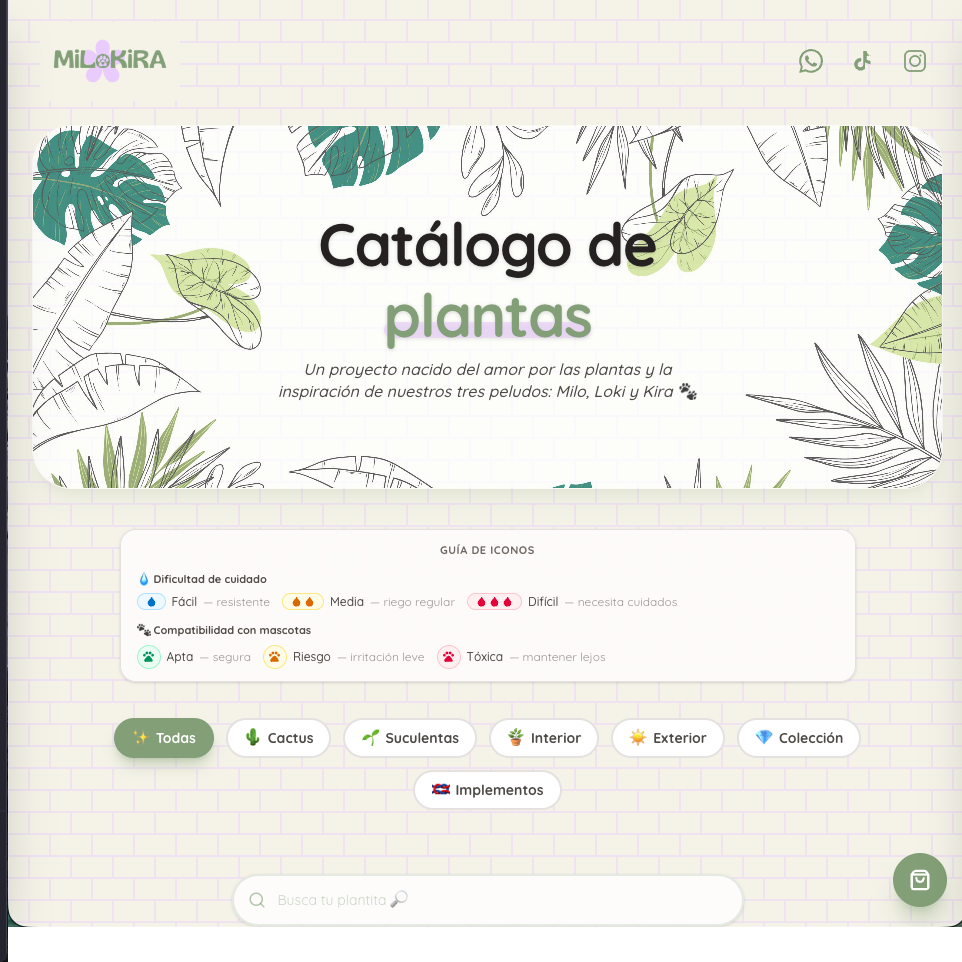
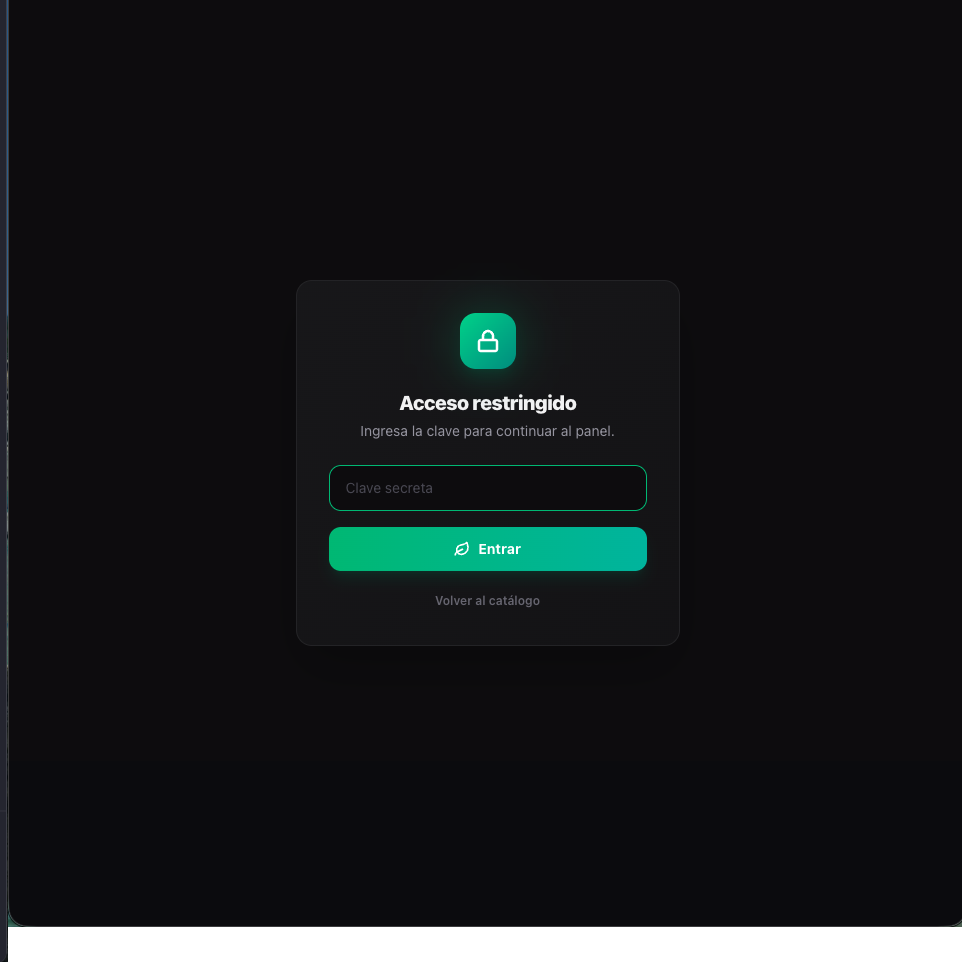
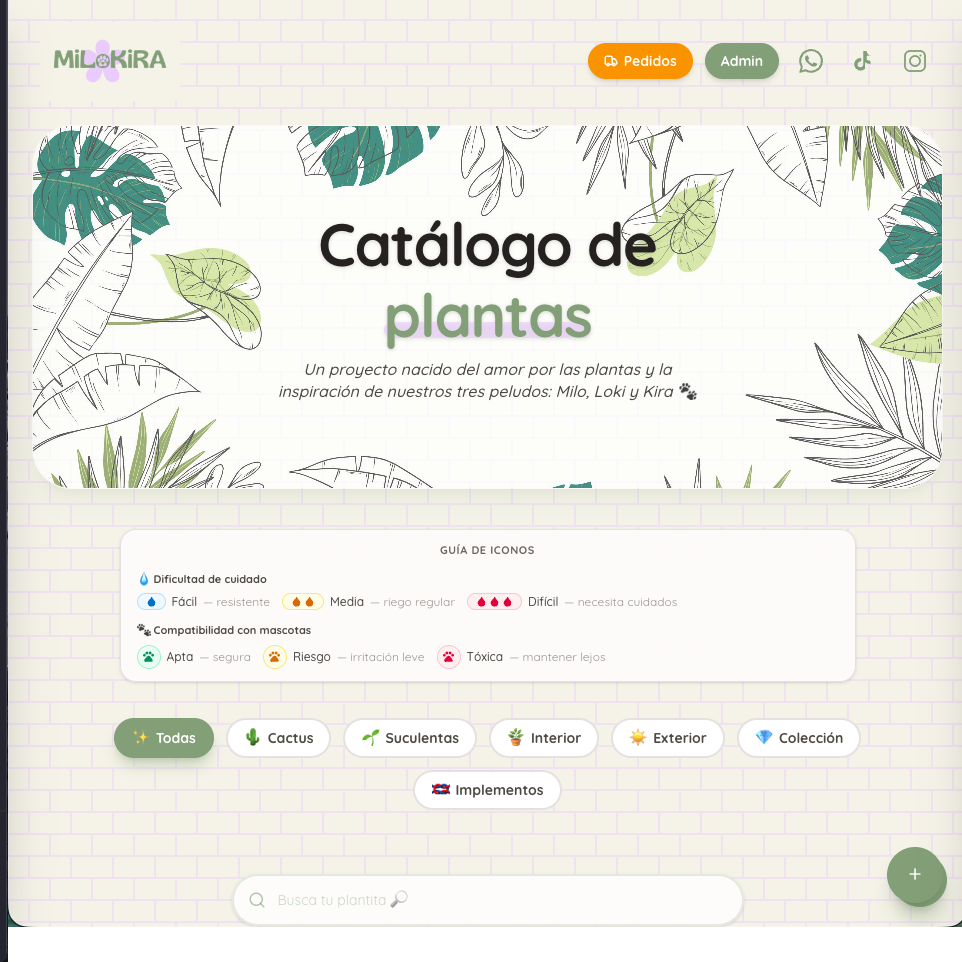
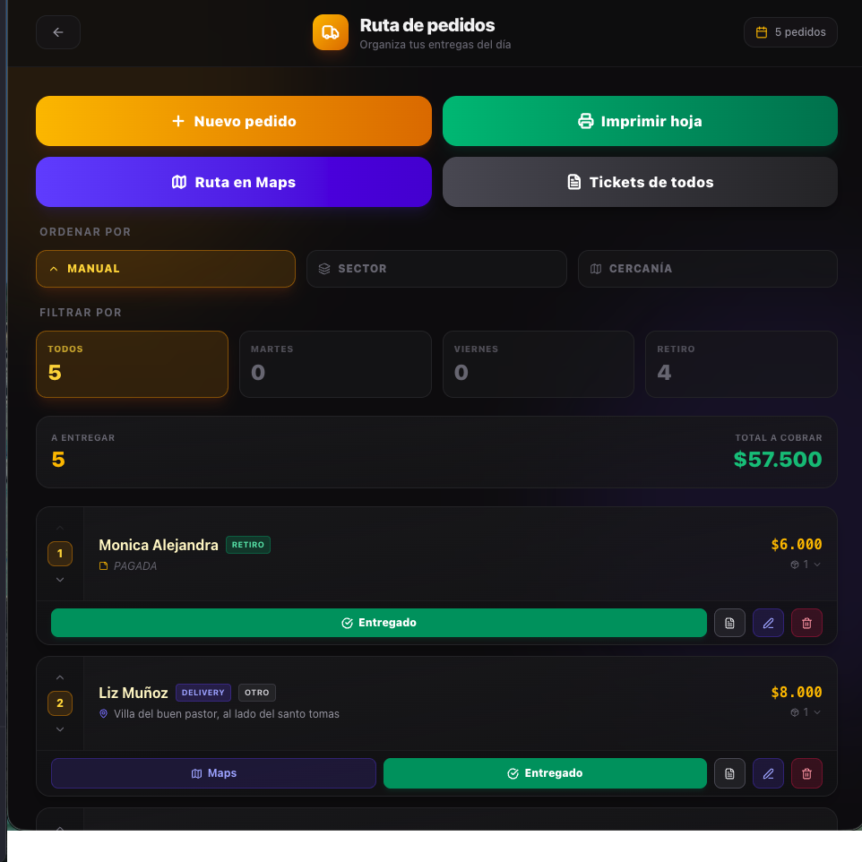
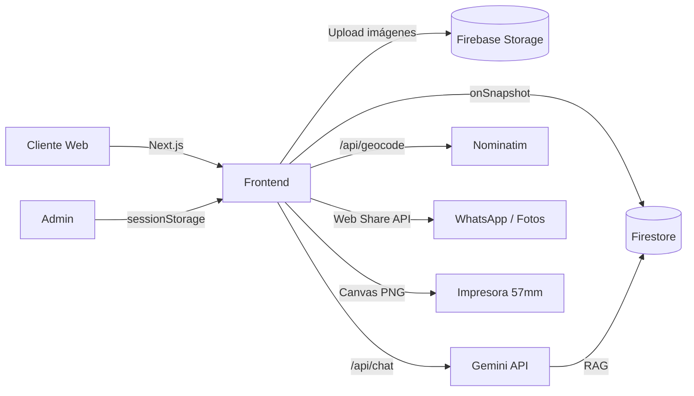

<div align="center">

  

  <p><em>Catálogo de plantas y panel de gestión integral para un vivero familiar de Talca, Chile 🌿</em></p>

  
  
  
  
  
  
  
  

  <p>
    <a href="https://milokira-catalogo.vercel.app"><strong>Ver demo →</strong></a>
    ·
    <a href="https://github.com/karlacabanas01/milokira-catalogo/issues">Reportar bug</a>
    ·
    <a href="https://www.linkedin.com/in/karla-cabanas/">LinkedIn</a>
  </p>

</div>

---

## Sobre el proyecto

**Milokira** comenzó como un catálogo simple para vender plantas en Instagram y terminó siendo un mini-ecosistema completo: catálogo público, panel administrativo, gestión de pedidos con rutas optimizadas, integración con IA y generación de tickets para impresora térmica.

Es un proyecto real, en producción, que usa mi mamá 💚 para gestionar el día a día de su vivero en Talca. Cada feature nació de una necesidad concreta:

- *"No alcanzo a copiar el catálogo a Instagram cada vez que llega algo nuevo"* → catálogo público sincronizado con Firestore.
- *"Pierdo los Post-it con las direcciones de delivery los martes"* → panel de pedidos con ruta optimizada y tickets.
- *"Me preguntan mucho si esta planta es tóxica para perritos"* → iconos en cada card.

<div align="center">
  
  <p><sub>Vista pública: hero ilustrado, guía de iconos y catálogo responsive.</sub></p>
</div>

---

## ✨ Features principales

### Catálogo público
- 🌱 **Catálogo** sincronizado en tiempo real con Firestore.
- 🔍 Búsqueda + filtros por categoría con chips animados.
- 💧 **Iconos de cuidado** (Fácil / Media / Difícil) y 🐾 **toxicidad para mascotas** (Apta / Riesgo / Tóxica) en cada planta.
- 📱 Diseño responsive (banner ilustrado se adapta y se oculta en mobile para dar protagonismo al contenido).
- 🛒 Carrito persistente en `localStorage` con consulta directa por WhatsApp.

### Panel de administración
- 🔒 Ruta `/admin` protegida por gate de contraseña en `sessionStorage`.
- 📦 **Inventario** con CRUD completo: imágenes con drag para reposicionar, descripción, categorías, dificultad, toxicidad.
- 💰 Gestión de **ventas directas** y **gastos** con estadísticas.
- 📊 Dashboard con métricas: ingresos, egresos y ganancia neta.

<div align="center">
  <table>
    <tr>
      <td align="center" width="50%">
        <br/>
        <sub>Gate de acceso al panel admin.</sub>
      </td>
      <td align="center" width="50%">
        <br/>
        <sub>Catálogo en modo admin (con accesos directos).</sub>
      </td>
    </tr>
  </table>
</div>

### Sistema de pedidos
- 🚚 Ruta `/admin/pedidos` con cards por pedido (cliente, dirección, día, sector, items).
- 📍 **Geocoding gratuito con Nominatim** (OpenStreetMap) para obtener coordenadas reales.
- 🗺️ **Ordenamiento por cercanía** con algoritmo vecino más cercano + Haversine, partiendo desde el sector base.
- 🧭 Botón "Abrir ruta en Maps" que genera URL multi-stop con waypoints optimizados.
- ✏️ Editar, borrar, marcar entregado y agregar notas internas por pedido.

<div align="center">
  
  <p><sub>Ruta del día con filtros, ordenamiento por cercanía y acciones rápidas por pedido.</sub></p>
</div>

### Ingreso de mercadería 📦
- 🧾 **Parser de listas pegadas**: pega el detalle del recibo del proveedor (3 formatos detectados: con `/unid`, todo en una línea, multilínea con precios separados) y el sistema crea las plantas. Detecta precios tachados y usa el efectivo.
- 💸 **Cálculo de costo real por planta**: prorratea IVA (configurable) + despacho entre las unidades totales y divide por `plantasPorMaceta`. Cero matemática manual.
- 🎯 **Precio sugerido con redondeo comercial**: aplica un margen configurable y redondea al múltiplo de $500 (bajo $10k) o $1.000 (sobre $10k) más cercano. Editable a mano cuando el negocio manda.
- ✅ **Confirmación pre-ingreso al inventario**: detecta si una planta ya existe y pregunta *"Sumar al stock actual o Reemplazar"*, evitando duplicar stock por error.
- 🛠️ **Botón "Corregir costo"**: recalcula y actualiza el costo/margen en inventario sin tocar fotos, descripciones ni categorías editadas a mano. Útil cuando se descubre un error en una compra ya cerrada.
- 📊 **Resumen de ganancia esperada**: para las plantas seleccionadas muestra inversión, ingreso esperado y ganancia con margen real efectivo.

<!-- Pendiente: screenshot del módulo de Mercadería (public/docs/05-mercaderia.png) -->

### IA: Kira 🐶
- 🤖 Chat con personalidad (la perrita oficial de Milokira) usando **Google Gemini 2.5 Flash Lite**.
- 📚 **RAG simple**: retrieval por keywords desde colección `ConocimientoKira` que se inyecta como contexto antes de la respuesta.
- 🛡️ System prompt estricto que mantiene a Kira solo en el dominio de plantas/jardinería.
- ⏱️ Rate limit por sesión (5 consultas/día) en localStorage.

### Tickets térmicos
- 🖨️ Generación de **PNG optimizado para impresoras térmicas de 57mm** (TASBEL/Phomemo).
- ⚙️ Canvas a resolución 2x con **binarización 1-bit** (umbral de luminancia) para eliminar grises del anti-aliasing.
- 📲 Web Share API para enviar directo a WhatsApp o guardar en Fotos.
- 🎫 Vista a pantalla completa con instrucciones de impresión.

### Formulario público de pedidos
- 🔗 Ruta `/formularioPedidoClientes` aislada (sin header/footer/carrito).
- 📝 Lista dinámica de plantas con + Agregar / quitar fila.
- 📞 Input de teléfono con prefijo fijo `+56 9` y validación de 8 dígitos.
- 🏘️ Selector de sector + dirección + día de entrega.
- 💾 Crea el pedido directo en Firestore como `pending`.

---

## 🛠️ Stack tecnológico

| Capa | Tecnología |
|---|---|
| **Framework** | Next.js 16 (App Router) + React 19 |
| **Lenguaje** | TypeScript 5 |
| **Estilos** | Tailwind CSS 4 |
| **Backend / DB** | Firebase Firestore (NoSQL) + Firebase Storage |
| **Autenticación** | Sesión con contraseña en `sessionStorage` (proyecto familiar, sin OAuth) |
| **IA** | Google Gemini API (`@google/generative-ai`) |
| **Geocoding** | Nominatim (OpenStreetMap) — gratuito, sin API key |
| **Mapas** | Google Maps Directions URL — multi-stop sin API key |
| **Iconos** | Lucide React + React Icons |
| **PDF/Imagen** | Canvas API nativo (binarización 1-bit) |
| **Deploy** | Vercel |

---

## 🏗️ Arquitectura simplificada



**Decisiones técnicas destacadas:**

- **Server-side rendering selectivo**: las rutas públicas son `static` (SEO + cache), las admin son `client-only`.
- **Sin SDK de Firebase Admin**: como es un proyecto chico, uso el SDK cliente con security rules estrictas.
- **API key de Gemini protegida**: vive solo en el servidor (`GEMINI_API_KEY` sin prefijo `NEXT_PUBLIC_`).
- **Geocoding cacheado en Firestore**: cada dirección se geocodifica una sola vez, luego sus `lat/lng` se reutilizan.
- **Imágenes WebP**: conversión automática en el cliente antes de subir a Storage.

---

## 🚀 Setup local

### Requisitos

- Node.js 20+
- npm o pnpm
- Cuenta de Firebase con Firestore + Storage habilitados
- API key de Google Gemini ([AI Studio](https://aistudio.google.com/apikey))

### Pasos

```bash
# 1. Clonar
git clone https://github.com/karlacabanas01/milokira-catalogo.git
cd milokira-catalogo

# 2. Instalar
npm install

# 3. Crear .env.local con tus credenciales
cat > .env.local <<EOF
NEXT_PUBLIC_FIREBASE_API_KEY=tu_key
NEXT_PUBLIC_FIREBASE_AUTH_DOMAIN=tu_dominio
NEXT_PUBLIC_FIREBASE_PROJECT_ID=tu_proyecto
NEXT_PUBLIC_FIREBASE_STORAGE_BUCKET=tu_bucket
NEXT_PUBLIC_ADMIN_PASSWORD=tu_clave_admin
GEMINI_API_KEY=tu_gemini_key
EOF

# 4. Dev server
npm run dev
```

Abre [http://localhost:3000](http://localhost:3000).

### Acceder al panel admin

1. En la home, haz **5 clics rápidos al logo de Milokira**.
2. Introduce la clave configurada en `NEXT_PUBLIC_ADMIN_PASSWORD`.
3. Aparece el botón **"Admin"** en el header.

---

## 📂 Estructura del proyecto

```
app/
├── page.tsx                    # Catálogo público
├── layout.tsx                  # Layout raíz
├── globals.css
├── firebaseConfig.js
├── components/                 # Componentes públicos
│   ├── plant-card.tsx
│   ├── plant-chat.tsx          # Chat IA Kira
│   ├── cart-drawer.tsx
│   └── agregar-planta-modal.tsx
├── admin/
│   ├── page.tsx                # Dashboard
│   ├── layout.tsx              # Admin guard
│   ├── components/             # Modales: producto, gasto, venta, pedido, conocimiento
│   └── pedidos/
│       ├── page.tsx            # Lista + ruta optimizada
│       ├── ticket/page.tsx     # Vista previa de tickets
│       ├── ticketImg.ts        # Generador PNG con binarización 1-bit
│       └── imprimir/page.tsx   # Vista A4 imprimible
├── api/
│   ├── chat/route.ts           # Gemini + RAG
│   └── geocode/route.ts        # Nominatim proxy
├── formularioPedidoClientes/   # Form público de pedidos
├── context/CartContext.tsx
└── data/inventario.js
scripts/
├── migrate-*.mjs               # Migraciones de Firestore
└── seed-*.mjs                  # Seeders (dificultad, mascotas, conocimiento Kira)
```

---

## 🎯 Highlights técnicos

Algunos problemas que disfruté resolver:

### 1. Tickets térmicos sin librerías de pago
Las mini impresoras tipo TASBEL convierten cualquier PDF a imagen y lo rasterizan mal. Solución: generar **PNG nativo** con `<canvas>` al **doble de resolución** (768×variable px), luego binarizar a 1 bit (umbral de luminancia 160) para eliminar grises del anti-aliasing. Resultado: tickets perfectamente nítidos sin pagar por una librería de impresión.

### 2. Ruta optimizada sin Google Maps API
Combinación de:
- **Nominatim** (OpenStreetMap, gratuito) para geocoding, llamado desde un Next.js API route con `User-Agent` correcto.
- **Haversine + vecino más cercano** para ordenar los pedidos partiendo del sector base.
- **Google Maps Directions URL** (no API) para abrir la ruta multi-stop en el celular.

Ahorro estimado vs Google Geocoding API: **$5/mes** de la cuota.

### 3. RAG simple sin vector databases
Para que Kira (la IA) hable como experta del catálogo sin alucinaciones:
- Colección `ConocimientoKira` en Firestore con `{ titulo, contenido, keywords[] }`.
- Al recibir una pregunta, hago **matching por keywords** con puntaje (match exacto = 3 pts, partial = 1 pt).
- Inyecto las top 3 entradas como contexto al system prompt.

Sin embeddings, sin vector DB, sin costos. Suficiente para un dominio acotado.

### 4. Seguridad client-side honesta
El panel admin se protege con clave en `sessionStorage` — sé que **no es seguridad real**. Para evitar accesos directos a Firestore agrego security rules estrictas. El gate es solo para que un usuario casual no descubra `/admin` por URL.

### 5. Parser tolerante a 3 formatos de recibo
El recibo del proveedor llega en HTML→texto plano con quiebres de línea inconsistentes. En vez de pedirle al usuario que normalice, hice un parser que reconoce:

- **Formato A** (compacto explícito): `4x ARR. HYPOESTE B20 (Cód: PHYPOESTE20) - $1,650/unid`
- **Formato B** (todo en una línea): `4x ARR. HYPOESTE B20 $ 1,650 $ 6,600` — usa `unit × N === subtotal` como heurística para distinguir cuál precio es el unitario.
- **Formato C** (multilínea): `4x` / `NOMBRE` / `$ 1,550 $ 1,250` / `$ 5,000` — donde el primer precio puede ser tachado y el segundo el efectivo.

Todo cubierto por tests con el recibo real del vivero. El parser está extraído a `helpers.ts` puro, sin dependencias de React.

---

## 🧪 Testing

Tests unitarios con **Vitest** sobre la lógica pura del módulo de mercadería:

```bash
npm test              # una pasada
npm run test:watch    # watch mode
npm run test:coverage # con coverage
npm run typecheck     # tsc --noEmit
```

Cubre:

- `parsePastedList` — 9 tests sobre los 3 formatos del recibo + el recibo real completo (7 items mixtos).
- `redondearComercial` — 4 tests sobre redondeo por rango.
- `slugify` — 4 tests sobre normalización de nombres.
- `calcularCostoYsugerido` — 7 tests sobre IVA, despacho prorrateado, plantas/maceta y margen.

Total: **24 tests verdes en <200ms.**

---

## 🤝 Contacto

**Karla Cabañas** — Desarrolladora Full Stack 🇨🇱

- 💼 LinkedIn: [linkedin.com/in/karla-cabanas](https://www.linkedin.com/in/karla-cabanas/)
- 🐙 GitHub: [@karlacabanas01](https://github.com/karlacabanas01)
- 📧 Email: recursos@arq-it.cl

> Si te gustó este proyecto y construyes algo similar, me encantaría conocerlo 🌱

---

<div align="center">

  *Hecho con cariño desde Talca 🇨🇱*

  ⭐ Si te sirvió de inspiración, dale una star al repo

</div>
